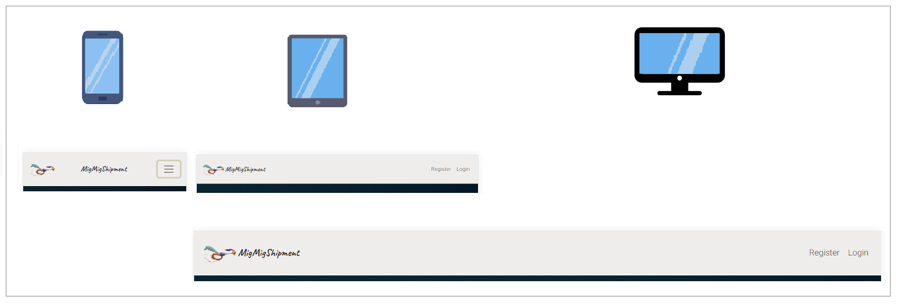
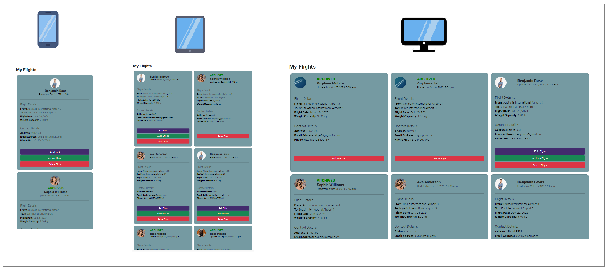

# MigMigShipment

[Live webpage](https://migmig-bcca17837059.herokuapp.com/)

[Repository](https://github.com/strasse34/pp4-migmig)

# Table of Contents
1. [Introduction](#introduction)
2. [Design](#design)
   - [Project Goals](#project-goals)
   - [Database Design](#data-base-design)
   - [User Experience - UX](#user-experience---ux)
   - [Scope](#scope)
   - [Structure](#structure)
   - [Colors and Fonts Used](#colors-and-fonts-used)
   - [Wireframes](#wireframes)
3. [Agile Development](#agile-development)
   - [Iterations](#iterations)
   - [Developed Features](#developed-features)
      - [Header and Navigation](#header-and-navigation)
      - [Alarm](#alarm)
      - [Hero Image](#hero-image)
      - [Page Title and Search Bar](#page-title-and-search-bar)
      - [Upcoming Flights (Home Page)](#upcoming-flights-home-page)
      - [Flight Card in Home Page](#flight-card-in-home-page)
      - [Quote](#quote)
      - [Footer](#footer)
      - [My Flights Page](#my-flights-page)
      - [Flight Card in My Flights Page](#flight-card-in-my-flights-page)
      - [Edit, Archive, and Delete Pages](#edit-archive-and-delete-pages)
      - [Contact Traveler Page](#contact-traveler-page)
      - [All_Auth Pages](#all_auth-pages)
4. [Future Development](#future-development)
5. [Technologies Used](#technologies-used)
   - [Languages](#languages)
   - [Frameworks & Tools](#frameworks--tools)
6. [Testing and Validation](#testing-and-validation)
7. [Heroku Deployment](#heroku-deployment)
   - [Requirements and Procfile](#requirements-and-procfile)
   - [Setting Up a Database](#setting-up-a-database)
   - [The env.py File](#the-envpy-file)
   - [Heroku](#heroku)
      - [Creating a Heroku App](#creating-a-heroku-app)
      - [Setting Environment Variables](#setting-environment-variables)
      - [Connecting to GitHub and Deployment](#connecting-to-github-and-deployment)
      - [Forking the Repository](#forking-the-repository)
      - [Making a Local Clone](#making-a-local-clone)
8. [Credits](#credits)
    - [Media](#media)
    - [Code](#code)
9. [Acknowledgements](#acknowledgements)

## Introduction

Welcome to MigMigShipment, a solution for efficient parcel shipping! MigMigShipment connects individuals in need of swift parcel delivery with travelers heading in the same direction. The platform streamlines the process of sending parcels, providing a reliable and cost-effective alternative to traditional shipping services. Whether you're a traveler willing to help others while earning extra income or someone looking to ship a package swiftly and securely, MigMigShipment is here to make the process seamless. 

This project is part of the Code Institute's Full Stack Diploma Program. I used technologies of Django, Python, JavaScript, CSS, and HTML to build it. Data is stored in a PostgreSQL database.

## Design
### Project Goals

The primary goal of this project is to provide a significant solution for individuals in urgent need of parcel delivery. It aims to bridge the gap for fast and reliable delivery services, especially for long-distance shipments. With this app, a traveler and a parcel holder can seamlessly connect and negotiate the delivery cost, making it a convenient and efficient way to get parcels to their destinations quickly. This project envisions making the process of urgent parcel delivery smoother and more accessible for everyone involved.

### Data Base Design

The Entity Relationship Diagram (ERD) illustrates the structure of the database which lies at the core of the functionality of the site:

In the database design for my application, **User** is implemented using Django Allauth, simplifying user authentication and management. The **User** table contains fields for *username*, *password*, and *email*, with the *username* serving as the primary key.

The core data of the application is stored in the **FlightDetails** table. This table captures essential information about flights and travelers, such as *origin*, *destination*, *flight_date*, *weight_capacity*, *slug*, and personal traveler information. The *traveler* field establishes a relationship with the **User** table, allowing each flight to be associated with a specific user.

To manage the status of flights, the **Status** table has been introduced. It includes a *slug* field as the primary key, along with *active* and *archived* fields to track the status of each flight.

This database structure efficiently organizes and manages data for my application, ensuring seamless user authentication and comprehensive flight details management.

**Future Models**

As part of the ongoing development of my application, I envision an additional model to enhance user interaction and flexibility. One such model is the **ContactRequest** model, designed to facilitate secure communication between travelers and other users.

The **ContactRequest** model will enable users to send and receive contact requests. When a traveler posts a flight, he/she can receive requests from other users interested in the posted flight details. The traveler will have the option to selectively reveal the contact details to specific users, fostering trust and privacy.

This addition will enhance the user experience, allowing for seamless communication and negotiation between travelers and potential partners. As my application continues to evolve, these future models will play a pivotal role in expanding its functionality and user engagement.

### User Experience - UX

The application was developed considering the four planes of User Experience:

#### EPICS and User Stories

**EPIC-1: User registration**
- As a user, I can make an account, so that I can use web app services.
- As a user, I can use my username and password, so that I can log in to my account.
- As a user, after authentication, I can see my username on the website after login, so that I can be sure that I am logged in.

**EPIC-2: Add flight details cards**
- As a user, After authentication, I can add a new flight card, so that other users can see my flight card.
- As a logged-in user, while filling out the form, I can select the airport from the dropdown list. so that I can find the origin and destination airports easily.
- As a logged-in user, I can click on flight cards, so that I can see the complete flight details and traveler's contact details.

**EPIC-3: Manage cards**
- As a user, after authentication, I can edit my posted cards. so that I can change the card information and repost it.
- As a user, after authentication, I can archive my posted cards. so that I can move those cards from the public page to my flight page.
- As a user, after authentication, I can delete my posted cards. so that I can remove card information from the database.
- As a user, I want to see the updated date after I or other users edit a card, So that I and other users will understand that the card has been modified.
- As a user, I want flight cards to be archived when they cross the flight date. so that other users will not misunderstand outdated flight cards.

**EPIC-4: Landing page**
- As a guest visitor user, I can see all the flight cards and other information on the first page, so that I can get familiar with the app and view the basic flight information.
- As a guest visitor user, I can search among available cards, so that I can find proper flight cards quickly and easily.

#### Target Audience

The MigMigShipment application is designed to cater to a diverse audience with varying needs and preferences. Our primary target audience includes individuals and businesses seeking a reliable and efficient solution for the urgent delivery of parcels over long distances. Travelers who are frequently on the move and willing to carry parcels can also benefit from our platform by earning extra income while traveling.

### Scope
#### Core Website Functionality
- Implement registration/login/log out features for access to core site functionality.
- Implement a form to add new flight details and traveler's contact details (flight card) to the site.
- Implement a feature to edit the flight cards.
- Implement a feature to  archive the filght cards.
- Implement a feature to delete the flight cards.

#### Responsiveness
- Implement responsive design for smooth desktop, tablet, and mobile device access.

### Structure
The website has 10 pages for the users who get registered.

#### Pages
- **Home Page** includes signup/login links in the navigation bar, a banner to catch eye, all the active flight cards which have been posted with all users with the ability of search, and quote sections to share user's experiences. Banner and quote space are hiden after user authentication.
- **Register Page** allows the user to create an account to access the core functionality of the site.
- **Login/Logout Pages**  allows the registered user to authenticate or log out of their account.
- **Add Flight Page**  allows the authenticated user to record a new flight card to database.
- **My Flight Page**  allows the authenticated user to see all the flight cards that have been posted by that user.
- **Contact Traveler Page**  allows the authenticated user to see traveler's contact details.
- **Edit Flight Page**  allows the authenticated user to edit their recorded cards.
- **Archived Flight Page**  gets confirmation from an authenticated user for archiving a specific card.
- **Delete Flight Page**  gets confirmation from an authenticated user for deleting a specific card.
- **404 page** when a page gets problem and user can not reach it.

### Colors and Fonts used

#### Color
I've based my website's color scheme on the lively Migmig cartoon character, which serves as the app's logo. I opted for the Migmig character because of its inherent speediness, which aligns perfectly with the core emphasis on speed within my app. The character's swift nature serves as a fitting representation for the importance I place on speed in my application. By using [Coolors.co](https://coolors.co/) to extract colors from the character, I've created a cohesive and engaging design.

#### Font
I have used two distinct fonts in my website design:
- **Caveat:** This font is applied to the website's name to create a harmonious connection with the logo, adding a touch of personalization and uniqueness.
- **Roboto:** For the main body text, I've chosen the 'Roboto' font. It's a popular and easy-to-read typeface that ensures a comfortable reading experience for visitors.

#### Wireframes
- [Home (Not authenticated)](static/docs/images/wireframes/home-not-login.png)
- [Home (Authenticated)](static/docs/images/wireframes/home-loggedin.png)
- [Add Flight](static/docs/images/wireframes/add-flight.png)
- [My Flight](static/docs/images/wireframes/my-flight.png)
- [Contact Traveler](static/docs/images/wireframes/contact-traveler.png)

## Agile Development
### Iterations
Githup was used to complete this project. The project was completed in 5 iterations.
- **Iteration 1**: I started by defining the user profile.
- **Iteration 2**: In the second phase, I focused on creating the database, designing forms, and developing the relevant pages.
- **Iteration 3**: Styling and visual enhancements were completed during the third iteration.
- **Iteration 4**: The fourth phase addressed any remaining "would-have" features and resolved any lingering uncertainties or issues. 
- **Iteration 5**: In the fifth and final iteration, I conducted testing, deployed the project, and documented the entire process.

### Developed Features
#### Header and Navigation
**For authenticated users**

**For unauthenticated users**

#### Alarm
**Successful Message**
 
**dismissed Message**

#### Hero Image

#### Page Title and Search bar
The search bar is available on both authenticated and unauthenticated home pages. Users can select an airport from the list to find relevant flights. 

#### Upcoming Flights (Home page)
The upcoming flight list is identical for both authenticated and unauthenticated users. Each page displays six cards, and users can navigate between pages using a button at the bottom of the card space.

#### Flight Card on home page
The flight cards on the home page feature the poster's username, the card's creation or update date, and essential flight details. Notably, traveler contact details are intentionally omitted. To access complete information, only registered users can click the 'Contact Traveler' button. 

#### Quote 

#### Footer 

#### Add Flight page

#### My Flights page
This page showcases all the cards created by the logged-in user. It comprises both active cards (status=1, indicating flights with future dates still visible on the homepage) and archived cards (status=0, which can either be manually archived by the user or automatically when the flight date becomes outdated). Active cards offer three options for editing, archiving, and deleting, while archived cards have a single option for deletion.

#### Flight Card on my flights page
Each card displays the traveler's photo, name, and contact information. Account holders can also post on behalf of travelers who are not registered on the website. When a user archives a card, effectively removing it from the homepage, the card is visually marked with the word 'Archived' at the top, and the 'edit' and 'archive' buttons are no longer displayed.

#### Edit, archive and delete pages

#### Contact Traveler page
On the Traveler's Contact Details page, you will find a single card. This card shares many similarities with the cards on the 'My Flights' page, featuring both flight details and traveler contact information. However, it is presented in a distinct style.

#### All_Auth pages

## Future Development

- **Request Feature:** Travelers will receive requests from parcel holders, and only after a traveler's confirmation, will the parcel holder gain access to the traveler's contact information. Parcel holders can provide additional details about their parcels when sending a request to a traveler.
- **Accept Request Feature:** Travelers have the option to accept or reject a request from a parcel holder.
- **Payment Feature:** Adding a payment feature, ensuring payment before revealing the traveler's contact information to the parcel holder.
- **More Details in Flight Cards:** Travelers can specify a fee for parcel delivery when posting their flight details. Flight cards will display not only the traveler's rating but also the number of total requests, rejected requests, and confirmed requests. It will also indicate the total confirmed weight capacity and the remaining available capacity.

- **Rating Feature:** Parcel holders will have the ability to rate the traveler's service.
- **Reliability Check:** Implementation of a trustworthiness mechanism for evaluating the reliability of travelers.

## Technologies Used
### Languages
- HTML: used as the main language to set up the structure of the website.
- CSS: used to style the website and ensure responsiveness.
- JavaScript: used to set time out for the messages.
- Python: used as the main language of the application. 

### Frameworks & Tools
- Django: Employed for establishing the website's backend logic and user model.
- GitHub: Utilized as the hosting platform for the website's source code. Additionally, it serves as the record-keeping system for implementing the Agile development framework, involving the use of GitHub's features like issues, milestones, and projects.
- gitpod: Employed for code writing, development, as well as code commit and push operations to GitHub.
- Heroku: Utilized for the live deployment of the website.
- Cloudinary: Serves as the cloud storage solution for website media and static files. 
- Bootstrap: Applied extensively throughout the site to ensure responsiveness, manage layouts, and employ predefined style elements.
- Balsamiq: Utilized in creating wireframes for the project.
- [dbdiagram](https://dbdiagram.io/home): Employed for designing the Entity-Relationship Diagram (ERD).
- [Google Fonts](https://fonts.google.com/): Imported to incorporate custom fonts into the website.
- [Font Awesome](https://fontawesome.com/): Used to integrate icon features into the site.
- [coolors](https://coolors.co/): Utilized for generating the website's color scheme.
- [amiresponsive](https://ui.dev/amiresponsive): Used to generate responsive screens of my website in different devices.
- [removal](https://removal.ai/): Used to remove background of logo image and make it transparent.
- Paint: Employed for creating feature images for readme file.

## Testing and Validation

The testing documentation can be found at [TESTING.md](TESTING.md)

## Heroku Deployment

### Requirements and Procfile

Before deploying your application on Heroku, ensure that two files are created and up to date: a `requirements.txt` file and a `Procfile`.

- To create the `requirements.txt` file, execute the following command in your terminal: `pip3 freeze --local > requirements.txt`. This will generate a file containing all the necessary requirements.
- Next, create a file named `Procfile` and add the following code to it: `web: gunicorn migmig.wsgi`, without any empty lines following it.
- Make sure to push these files to your repository.

### Setting Up a Database

- Log in to ElephantSQL.com and access your dashboard.
- Select "Create New Instance."
- Choose a plan, provide a name for your plan, select the "Tiny Turtle (Free)" plan, and leave the "Tags" field empty.
- Pick a data center location near you under "Select Region."
- Click "Review."
- Confirm your details and click "Create instance."
- Return to the ElephantSQL dashboard and click on the database instance name for your project.
- In the URL section, click the copy icon to copy the database URL.
- Ensure that Django and Gunicorn are installed in your workspace by running `pip3 install 'django<4' gunicorn`.
- Similarly, ensure that the infrastructure for the database is installed by running `pip3 install dj_database_url===0.5.0 psycopg2`.
- Update the `requirements.txt` file if necessary.

### The env.py File

- If you don't have an `env.py` file in your workspace, create one and make sure it's included in the `.gitignore` file.
- At the top of the `env.py` file, add the line: `import os`.
- Below that, add the following two lines:
  `os.environ["DATABASE_URL"] = "<copied URL from SQL database>"` 
  `os.environ["SECRET_KEY"] = "<create a secret key of your own>"` 
- If you're using Cloudinary storage, also add the following line:
`os.environ["CLOUDINARY_URL"] = "<copied URL from Cloudinary account>"` 
- Ensure that the environment variables are correctly imported into the settings.py file.

- Run python manage.py migrate in the terminal window to migrate the data structure to the database instance.

### Heroku
#### Creating a Heroku App

- Log in to Heroku and navigate to the Dashboard.
- Click "New" and then select "Create new app."
- Give your app a name and choose the region closest to you.
- Confirm by clicking "Create app."

#### Setting Environment Variables
- On the Heroku Dashboard, select the app you just created, and then go to the "Settings" tab.

- Click "Reveal Config Vars."

- Add the following config vars:

  - `DATABASE_URL`: Copy the database URL from ElephantSQL here; it should also be in the env.py file. 
  - `SECRET_KEY`: Copy your secret key here. 
- If you're using Cloudinary storage, include your personal CLOUDINARY_URL in these fields.
- Additionally, you may need the key PORT with the value 8000.

#### Connecting to GitHub and Deployment

- On the Heroku Dashboard, select the app you just created, and then go to the "Deploy" tab.
- Choose GitHub as the deployment method.
- Search for the name of the project repository and click "Connect."
- If desired, enable automatic deploys.
- Finally, select "Deploy Branch" and observe the app being built.

### Forking the Repository
- Log in to GitHub and find the GitHub repository you want to fork.
- Above the "Settings" tab in the Repository, click the "Fork" button.
- You will now have a copy of the original repository in your GitHub account, allowing you to make changes to the new version while keeping the original safe.

### Making a Local Clone
- Log in to GitHub and locate the repository you want to clone.
- Click the 'Code' dropdown above the file list.
- Copy the URL for the repository.
- Open Git Bash in your IDE.
- Change the current working directory to where you want the cloned directory.
- In the CLI, type git clone and paste the URL you copied earlier. It should look like this:
`$ git clone https://github.com/`
- Press Enter to create your local clone.
To install all the packages listed in the requirements file, you can use the following terminal command: `pip install -r requirements.txt`

## Credits
### Media
- I used [Pexels](https://www.pexels.com), a license-free website, for all the images on my website.
- The logo picture is widely available and easily found through a quick search. I downloaded it from [Pinterest](https://www.pinterest.de/monociclos/).

### Code
- I drew inspiration from the following resources:
  - "I Think Therefore I Blog" (Please provide full name or source if available).
  - "The WorldTravel Log" by [Ulrike Riemenschneider](https://github.com/URiem).
  - "Jobs-A-Gooden" by [David Bowers](https://github.com/dnlbowers).

- I frequently consulted the following resources during my project:
  - [Stack Overflow](https://stackoverflow.com)
  - YouTube channel: [Programming with Mosh](https://www.youtube.com/user/programmingwithmosh)
  - YouTube channel: [Vision Academy](https://www.youtube.com/user/visionacademy)
  - [Django Documentation](https://docs.djangoproject.com/en/4.2/)
  - [Bootstrap 4 Documentation](https://getbootstrap.com/docs/4.6/getting-started/introduction/)

## Acknowledgements
- I extend my heartfelt gratitude to my mentor, David Bowers, for his invaluable feedback, advice, guidance, and unwavering support throughout this project.
- Special thanks to Kay Welfare, one of our cohort facilitators, for her valuable insights on course management, her direction towards a wealth of resources for project assistance, and her consistent presence in our informative Wednesday morning cohort discussions.
- I am immensely thankful to the supportive Slack community, which has repeatedly stepped in to assist in resolving issues and overcoming challenges during implementation.
- A heartfelt appreciation to the dedicated tutors at tutor support.
- Lastly, I want to express my thanks to my spouse, Saliha, for her encouragement and unwavering support throughout this journey.