# MigMigShipment Project Testing Document

[Back to the README](README.md)

## Table of Contents

## Performance and Accessibility
### Initial Results
For testing site performance and Accessibility, I used [google lighthouse.](https://developer.chrome.com/docs/lighthouse/overview/) In my initial test, I received a lower score due to several identified issues.  
**Desktop: Home Page** 
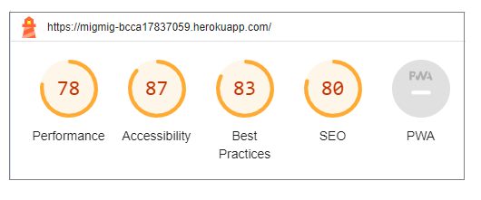 
**Mobile: Home Page** 
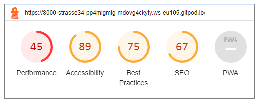
 
To enhance the performance and achieve a better score, I implemented the following changes:
### Optimization
**Hero Image Optimization**
- **Image Compression:** The primary issue was with the hero image, which was too large. I compressed the image multiple times to reduce its file size.
- **Image Format:** I converted the image format from JPG to WebP, which provides better compression without compromising quality.
- **Responsive Images:** To optimize mobile performance, I used a smaller image specifically for the mobile version, ensuring faster loading on smaller screens.

**Aria Labels** 
I added aria-label attributes to all relevant links throughout the website. This enhances accessibility and ensures that screen readers provide meaningful descriptions for links.

**Bootstrap CDN Duplication** 
I identified and resolved the issue of duplicating Bootstrap CDNs in the HTML head section. By removing one of them, I streamlined the page loading process.

**Image Ratio Standardization** 
In the quote section, I standardized the aspect ratios of images to maintain consistency. This not only improved visual appeal but also eliminated layout reflows, contributing to better performance.
### Final Score after Optimisation
Below are the final results of google lighthouse scores: 
**Desktop: Home Page** 
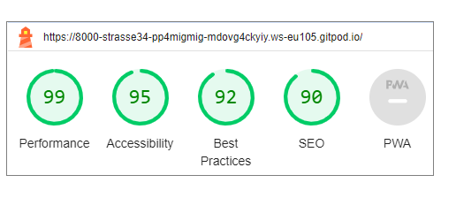 
**Mobile: Home Page** 
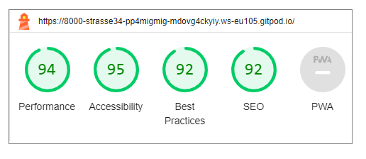 
**Desktop: My Flight Page** 
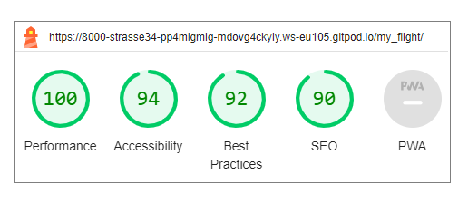 
**Mobile: My Flight Page** 
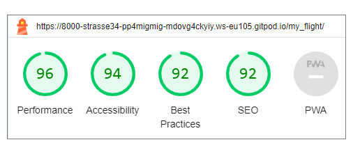 

## Code Validation
### HTML Valication
To validate my HTML code, I utilized the [W3C HTML Validator](https://validator.w3.org/). I encountered a few errors initially, but I was able to address and resolve each of them.  
**Initial Validation:** 
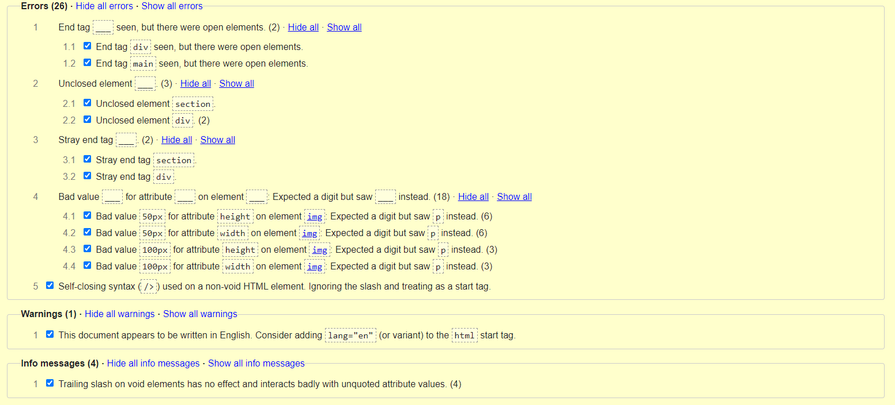
**Final Validation:** 
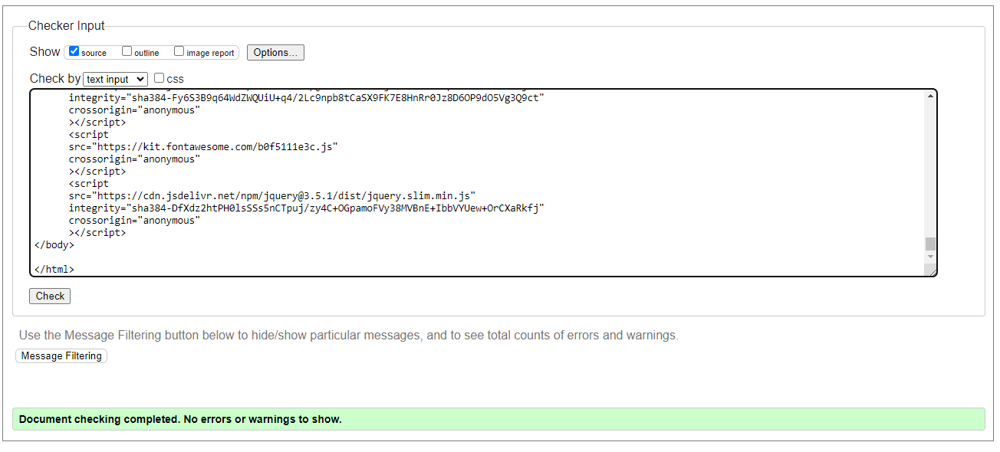
I got no error for all of other pages. 

### CSS Validation
I also ran my CSS file through the [W3C Jigsaw CSS Validation Service](https://jigsaw.w3.org/css-validator/) and found that it had no issues or errors.
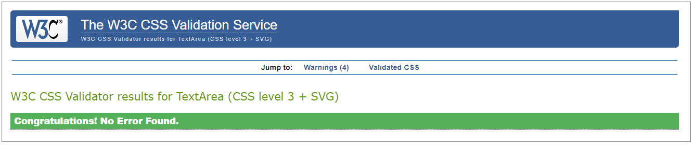

### JS Validation
I used [JSHint](https://jshint.com/) to test the only function in my base template and below is the result: 

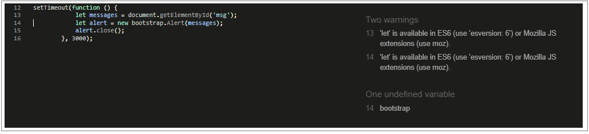

### Python Validation
I used [CI Python Linter](https://pep8ci.herokuapp.com/) to validate my Python code and resolved all minor issues. Here are the final test results.
**Admin** 
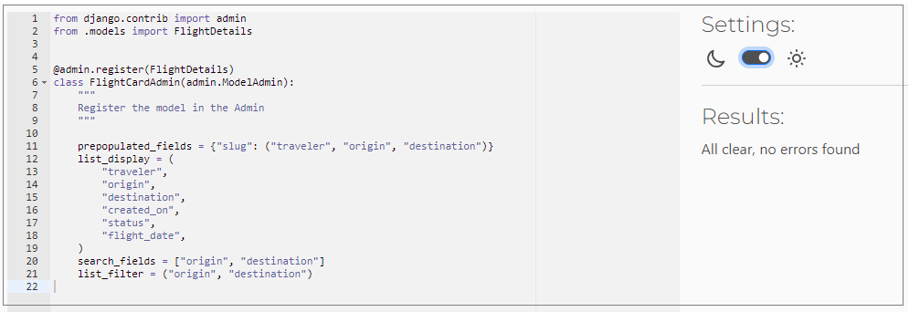
**Forms** 
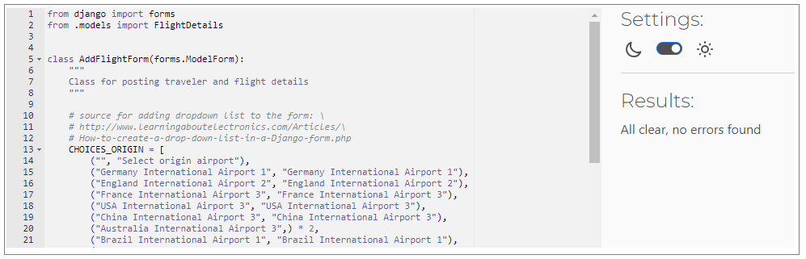
**Models** 

**App Urls** 
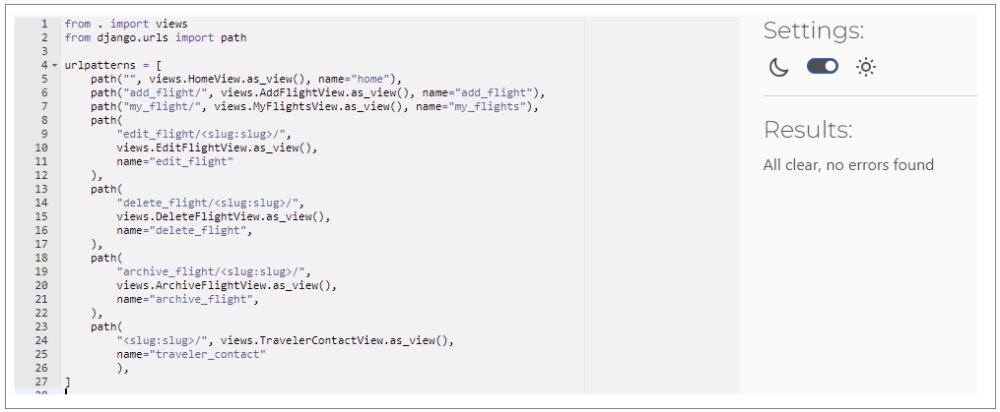
**Views** 
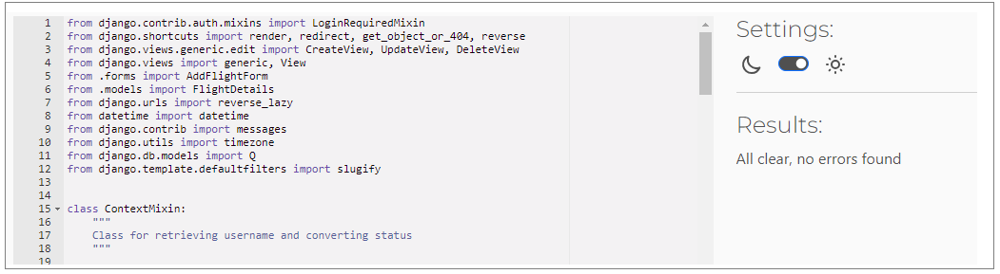
**Project Urls** 
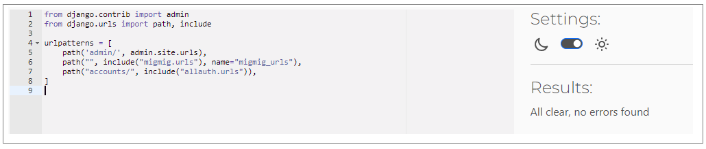

## Manual Testing
I conducted manual testing based on user stories, defining and testing multiple scenarios for each story. 

**User Story: As a user, I can make an account, so that I can use web app services.**
| Test Case | Steps | Expected Result | Pass/Fail |
| --- | ---- | --- | --- |
| Test Case 1: Verify Successful Register | 1- Navigate to the Registration page. 2- Fill in valid registration details. 3- Click the "Register" button. | User should be redirected to the Home page with a success message. | Pass |
| Test Case 2: Verify Invalid Register Attempt | 1- Navigate to the Registration page. 2- Fill in incomplete or invalid registration details. 3- Click the "Register" button. | User should see an error message indicating invalid registration data (e.g., incomplete form or existing username/email). | Pass |
| Test Case 3: Verify "Cancel" Button navigation| 1- Navigate to the Registration page. 2- Heat the "Cancel" button. | User should be directed to the Home page. | Pass |
 

**User Story: As a user, I can use my username and password, so that I can log in to my account.**
| **Test Case** | **Steps** | **Expected Result** | **Pass/Fail** |
| --- | --- | --- | --- |
| Test Case 1: Verify Successful Login | 1- Navigate to the Login page. 2- Enter valid username and password. 3- Click the "Login" button. | User should be redirected to the Home page with a successful message. | Pass |
| Test Case 2: Verify Invalid Login Attempt | 1- Navigate to the Login page. 2- Enter incorrect username or password. 3- Click the "Login" button. | User should see an error message indicating invalid login credentials. | Pass |
| Test Case 3: Verify "Cancel" Button navigation| 1- Navigate to the "Login" page. 2- Heat the "Cancel" button. | User should be directed to the Home page. | Pass |
 

**As a user, after authentication, I can see my username on the website after login. So that I can be sure that I am logged in.**
| **Test Case** | **Steps** | **Expected Result** | **Pass/Fail** |
| --- | --- | --- | --- |
| Test Case 1: Verify airport selection while adding flight in Add Flight page |1- Navigate to the Login page. 2- Enter valid username and password. 3- Click the "Login" button. | The user's username should be visible on the navigation bar in the right side, indicating that the user is logged in.| Pass |

**User Story: As a guest visitor user, I can see all the flight cards and other information on the first page, so that I can get familiar with the app and view the basic flight information.**
| **Test Case** | **Steps** | **Expected Result** | **Pass/Fail** |
| --- | --- | --- | --- |
| Test Case 1: Verify Viewing first page of the website as a Guest | 1- Open the web app as a guest visitor (not logged in). 2- Observe the hero image, flight cards including flight information, quotes and footer displayed on the first page. | All flight cards and relevant information are visible and accessible to the guest visitor on the first page. | Pass |
| Test Case 2: Verify Not navigation to Traveler's Contact Detial page| 1- Open the web app as a guest visitor (not logged in). 2- Click on button "Contact Traveler" on each card. | The guest visitor can click on the button but he/she is redirected to the sign-up page instead of viewing the contact details. | Pass |
| Test Case 3: Verify navigation to Registration page | 1- Open the web app as a guest visitor (not logged in). 2- Click on the "Join Us!" on hero image or "Register" in navbar. | The guest visitor should be directed to the Registration page where he/she can register for an account if they choose to do so. | Pass |
 

**User Story: As a logged-in user, I can click on flight cards, so that I can see the complete flight details and traveler's contact details.**
| **Test Case** | **Steps** | **Expected Result** | **Pass/Fail** |
| --- | --- | --- | --- |
| Test Case 1: Verify viewing Home page | 1- Log in to the web app as a registered user. | After log in the user can access the homepage containing all flight cards without encountering any errors or redirection issues. | Pass |
| Test Case 2: Verify viewing Traveler's Contact Info page | 1- Log in to the web app as a registered user. 2- Click on the "Contact Traveler" button associated with a flight card. | The user should be able to click on the "Contact Traveler" button and redirected to Traveler Contact Details page where there are the contact information of the traveler associated with the selected flight card, including name, email, or other contact details provided by the traveler. | Pass |
| Test Case 3: Verify navigation back to Upcoming Flights page from "Traveler's Contact" page | 1- Log in to the web app as a registered user. 2- Click on the "Contact Traveler" button on one of the flight card to be directed to Traveler's Contact Details page. 3- After viewing traveler's contact info, click on a "Home" navigation in navbar. | The user should be able to easily navigate back to the list of flight cards on the "Home" page after viewing traveler's contact info. | Pass |
 

**User Story: As a user, after authentication, I can add a new flight card, so that other users can see my flight card.**

| **Test Case** | **Steps** | **Expected Result** | **Pass/Fail** |
| --- | --- | --- | --- |
| Test Case 1: Verify viewing Add Flight page by clicking on "Add Flight" navigation on navbar | 1- Log in to the web app as a registered user. 2- Navigate to the 'Add Flight' page by clicking on the 'Add Flight' navigation link in the navbar. | The user should be directed to the 'Add Flight' page without encountering any errors. | Pass |
| Test Case 2: Verify adding flight using form when all fields are filled out correctly | 1- Log in to the web app as a registered user. 2- Navigate to the Add Flight page. 3- Fill out all the required fields on the Add Flight form with valid information. 4- Click the "Add Flight" button. | The flight card should be successfully added, and the user should receive a success message. The user directed to home page and his/her new flight card should be visible to other users in Home page and Contact Traveler page. The user also see his/her new card in My Flights page. | Pass |
| Test Case 3: Verify getting an error when origin and destination are the same | 1- Log in to the web app as a registered user. 2- Navigate to the Add Flight page. 3- Fill out the Origin and Destination fields with the same location. 4- Click the "Add Flight" button. | The user should receive an error message indicating that the origin and destination cannot be the same. | Pass |
| Test Case 4: Verify getting an error when origin, destination, name, and date of flight match an existing flight | 1- Log in to the web app as a registered user. 2- Navigate to the Add Flight page. 3- Fill out the Origin, Destination, Name, and Flight Date fields with information that matches an existing flight card. 4- Click the "Add Flight" button. | The user should receive an error message indicating that a flight with the same origin, destination, name, and date already exists. | Pass |
| Test Case 5: Verify getting an error when flight date ss already passed | 1- Log in to the web app as a registered user. 2- Navigate to the Add Flight page. 3- Fill out the Flight Date field with a date that has already passed. 4- Click the "Add Flight" button. | The user should receive an error message indicating that the flight date cannot be in the past. | Pass |
| Test Case 6: Verify getting an error when a field is left empty | 1- Log in to the web app as a registered user. 2- Navigate to the Add Flight page. 3- Leave one or more required fields empty on the Add Flight form. 4- Click the "Add Flight" button. | The user should receive an error message indicating that the empty field(s) need to be filled out. | Pass |
| Test Case 7: Verify "Cancel" Button navigation| 1- Navigate to the Add Flight page. 2- Heat the "Cancel" button. | User should be directed to the Home page. | Pass |
 

**User Story: As a logged in user, while filling out the form, I can select the airport from the dropdown list. So that I can find the origin and destination airports easily.**

| **Test Case** | **Steps** | **Expected Result** | **Pass/Fail** |
| --- | --- | --- | --- |
| Test Case 1: Verify airport selection while adding flight in Add Flight page |1- Log in to the web app as a registered user. 2- Navigate to the Add Flight page. 3- Click on "Form" or "To" fields| A dropdown list containing a list of airports should appear when you click on the "From" or "To"field.| Pass |

**User Story: As a guest visitor or authenticated user, I can search among available cards on the home page, so that I can find proper flight cards quickly and easily.**

| **Test Case** | **Steps** | **Expected Result** | **Pass/Fail** |
| --- | --- | --- | --- |
| Test Case 1: Search by selecting from dropdown list menu in search field | 1- Navigate to the Home page as a guest visitor or authenticated user. 2- Click on the dropdown list menu within the search field at the top of the Home page. 3- Select an airport from the list. 4- Click on "Find Flight" button. | The flight cards matching the search criteria should be displayed on the page. | Pass |
| Test Case 2: Search when there is no match | 1- Navigate to the Home page as a guest visitor or authenticated user. 2- Click on the dropdown list menu within the search field at the top of the Home page. 3- Select an airport from the list which is not included in any flight cards. 4- Click on "Find Flight" button. | The user should see a message on the page indicating "No flight was found!" as there are no matching flight cards for the search criteria. | Pass |

**User Story: As a user, after authentication, I can see all of my cards on the 'My Flights' page that I have already posted, so that I can manage my flight cards easily.**

| **Test Case** | **Steps** | **Expected Result** | **Pass/Fail** |
| --- | --- | --- | --- |
| Test Case 1: Reaching My Flights page from navigation | 1- Log in as a registered user. 2- Navigate to the "My Flights" page using the navigation menu. | The user should be directed to the My Flights page, displaying a all flight cards user has posted, both active and archived. | Pass |

**User Story: As a user, after authentication, I can edit my posted cards. so that I can change the card information and repost it.**

| **Test Case** | **Steps** | **Expected Result** | **Pass/Fail** |
| --- | --- | --- | --- |
| Test Case 1: Editing a Flight Card | 1- Log in as a registered user. 2- Go to the My Flight page. 3- Locate a flight card you have posted. 4- Click on the "Edit Flight" button for that card. 5- Modify the card information. 6- Click the "Update" button to update the card. | The card information should be updated, and the changes should be reflected on the card. A success message will be displayed. | Pass |
| Test Case 2: Error when Origin and Destination are the same | 1- Log in as a registered user. 2- Go to the My Flight page. 3- Locate a flight card you have posted. 4- Click on the "Edit Flight" button for that card. 5- Set the origin and destination to be the same. 6- Click the "Update" button to update the card. | An error message should be displayed indicating that the origin and destination cannot be the same. The card should not be updated. | Pass |
| Test Case 3: Error when Flight Date is in the past |  1- Log in as a registered user. 2- Go to the My Flight page. 3- Locate a flight card you have posted. 4- Click on the "Edit Flight" button for that card. 5- Set the Flight Date to previous date. 6- Click the "Update" button to update the card. | An error message should be displayed indicating that the flight date cannot be in the past. The card should not be updated. | Pass |
| Test Case 4: Error when a Field is Empty | 1- Log in as a registered user. 2- Go to the My Flight page. 3- Locate a flight card you have posted. 4- Click on the "Edit Flight" button for that card. 5- Leave onr or more fields blank. 6- Click the "Update" button to update the card. | An error message should be displayed indicating that the empty field needs to be filled. The card should not be updated. | Pass |
| Test Case 7:  Verify "Cancel" Button navigation| 1- Log in as a registered user. 2- Go to the My Flight page. 3- Locate a flight card you have posted. 4- Click on the "Edit Flight" button for that card. 5- Heat the "Cancel" button.| User should be directed to the Home page. | Pass |

**User Story: As a user, after authentication, I can archive my posted cards. So that I can hide those cards from public view.**

| **Test Case** | **Steps** | **Expected Result** | **Pass/Fail** |
| --- | --- | --- | --- |
| Test Case 1: Verify archiving a Card | 1- Log in to the web app as a registered user. 2- Navigate to the "My Flight" page. 3- Locate one of your posted cards that you want to archive. 4- Click on the "Archive Flight" button associated with the card. | You are directed to another page to get confirmation. If you click on "Archive" button, The card should be successfully archived. The card should no longer be visible to other users on the public homepage. "Archived" word should be added at the top of the card and the buttons for Archive and Edit should be removed. If you click on "Cancel" button, you should be directed to My Flight page. | Pass |

**User Story: As a user, after authentication, I can delete my posted cards. So that I can remove card information from the database.**

| Test Case | Steps | Expected Result | Pass/Fail|
| --- | --- | --- | --- |
| Test Case 1: Verify deleting a Card |1- Log in to the web app as a registered user. 2- Navigate to the "My Flight" page. 3- Locate one of your posted cards that you want to delete. 4- Click on the "Delete Flight" button associated with the card. |You are directed to another page to get confirmation. If you click on "Delete" button, The card should be successfully deleted. The card should no longer be visible to other users on the public homepage and your My Flight page. | Pass |

**User Story: As a user, I want flight cards to be archived when they cross the flight date. So that other users will not misunderstand outdated flight cards.**

| **Test Case** | **Steps** | **Expected Result** | **Pass/Fail** |
| --- | --- | --- | --- |
| Test Case 1: Verify automatic archiving of outdated a Flight Cards |1- Log in to the web app as a registered user. 2- Navigate to the Add Flight page. 3- Fill out all the required fields on the Add Flight form with valid information but set Flight Date field for tomorrow. 4- Click the "Add Flight" button. 5- Tomorrow check the card in Home page and your My Flight page. | The flight card with the modified flight date should be automatically archived since its flight date has passed. So it sould be removed from Home page but still exist in My Flights page with "Archived" title at the top of the card and removing "Edit Flight" and "Archive Flight" buttons.| Pass |

**As a user, I want to see the updated date after I or other users edit a card. So that I and other users will understand that the card has been modified.**
| **Test Case** | **Steps** | **Expected Result** | **Pass/Fail** |
| --- | --- | --- | --- |
| Test Case 1: Verify Updated Date display | 1- Log in as a registered user. 2- Go to the My Flight page. 3- Locate a flight card you have posted. 4- Click on the "Edit Flight" button for that card. 5- Modify the card information. 6- Click the "Update" button to update the card. | The flight card should display an "Updated" label along with the date and time of the last modification. This label indicates that the flight card has been modified, and the updated date and time should accurately reflect the changes made. | Pass |

