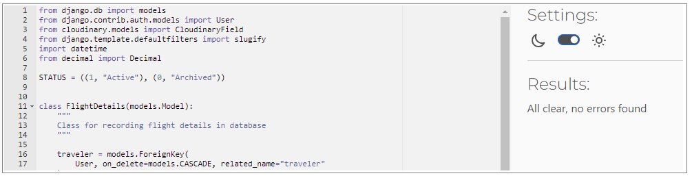

# MigMigShipment Project Testing Document

[Back to the README](README.md)

## Table of Contents

## Performance and Accessibility
### Initial Results
For testing site performance and Accessibility, I used [google lighthouse.](https://developer.chrome.com/docs/lighthouse/overview/) In my initial test, I received a lower score due to several identified issues.  
**Desktop: Home Page** 
 
**Mobile: Home Page** 

 
To enhance the performance and achieve a better score, I implemented the following changes:
### Optimization
**Hero Image Optimization**
- **Image Compression:** The primary issue was with the hero image, which was too large. I compressed the image multiple times to reduce its file size.
- **Image Format:** I converted the image format from JPG to WebP, which provides better compression without compromising quality.
- **Responsive Images:** To optimize mobile performance, I used a smaller image specifically for the mobile version, ensuring faster loading on smaller screens.

**Aria Labels** 
I added aria-label attributes to all relevant links throughout the website. This enhances accessibility and ensures that screen readers provide meaningful descriptions for links.

**Bootstrap CDN Duplication** 
I identified and resolved the issue of duplicating Bootstrap CDNs in the HTML head section. By removing one of them, I streamlined the page loading process.

**Image Ratio Standardization** 
In the quote section, I standardized the aspect ratios of images to maintain consistency. This not only improved visual appeal but also eliminated layout reflows, contributing to better performance.
### Final Score after Optimisation
Below are the final results of google lighthouse scores: 
**Desktop: Home Page** 
 
**Mobile: Home Page** 
 
**Desktop: My Flight Page** 
 
**Mobile: My Flight Page** 
 

## Code Validation
### HTML Valication
To validate my HTML code, I utilized the [W3C HTML Validator](https://validator.w3.org/). I encountered a few errors initially, but I was able to address and resolve each of them.  
**Initial Validation:** 

**Final Validation:** 

I got no error for all of other pages. 

### CSS Validation
I also ran my CSS file through the [W3C Jigsaw CSS Validation Service](https://jigsaw.w3.org/css-validator/) and found that it had no issues or errors.

### JS Validation
I used [JSHint](https://jshint.com/) to test the only function in my base template and below is the result: 

### Python Validation
I used [CI Python Linter](https://pep8ci.herokuapp.com/) to validate my Python code and resolved all minor issues. Here are the final test results.
**Admin** 

**Forms** 

**Models** 

**App Urls** 

**Views** 

**Project Urls** 

